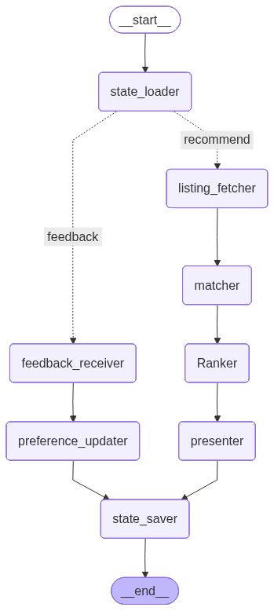

# RealEstateFinder

Persistent buyer preference learning for real-estate search using LangGraph, Pydantic v2, SQLite checkpointing, and Streamlit.

## Problem Summary

Home buyers refine their preferences over weeks of search. A buyer may start with budget and city, then realise after seeing homes that natural light, commute, or newer construction matters more than raw square footage. RealEstateFinder keeps a durable buyer memory across sessions, recommends new listings, captures feedback, and updates preference weights for the next visit.

## Architecture

Required LangGraph nodes are implemented in `realestate_finder/nodes.py`:

1. `state_loader`
2. `listing_fetcher`
3. `matcher`
4. `Ranker`
5. `presenter`
6. `feedback_receiver`
7. `preference_updater`
8. `state_saver`

The graph is compiled in `realestate_finder/graph.py` with `SqliteSaver`, so state survives Streamlit or Python process restarts when the same buyer thread id is reused. The graph uses conditional routing: recommendation sessions go through listing fetch, matching, ranking, and presentation; feedback submissions go through feedback validation and preference updating.

Architecture diagram:



Generate an updated diagram:

```bash
python scripts/draw_graph.py
```

## State Schema

The graph state is a Pydantic v2 `BuyerPreferenceState` with the mandatory fields:

- `buyer_profile: BuyerProfile`
- `preference_weights: dict[str, float]`
- `seen_listings: list[str]`
- `feedback_log: list[FeedbackEvent]`
- `session_count: int`
- `last_updated: datetime`

It also stores current recommendations, transient incoming feedback, KPI metrics, couple-mode settings, tour intent text, and learning errors.

## Preference Dimensions

The preference model tracks six required dimensions:

- `price`
- `size`
- `location`
- `light`
- `age`
- `amenities`

Feedback parsing uses Google AI Studio/Gemini with structured output. The production feedback updater does not use keyword matching. If `GOOGLE_API_KEY` is missing or Gemini fails, feedback is saved but preference weights are not changed and the UI shows a learning error.

## Hard Requirements And Data

The buyer profile enforces structured hard requirements:

- minimum bedrooms
- required amenities such as covered parking
- city
- budget band

The demo uses 30+ synthetic Bengaluru listings with a cooldown strategy, so 3+ sessions can keep showing five homes without exhausting the pool.

## KPIs Tracked

The app tracks the four business KPIs from the brief:

- preference inference accuracy through a blind final-priority check
- sessions to first strong yes
- listings filtered out as a percentage of broad candidates
- buyer engagement as sessions per buyer thread

## Bonus Features Included

- Explanation mode references prior feedback, for example disliked dark homes.
- Negotiation aide estimates fair price from comparable synthetic listings.
- Tour scheduling produces a tour-ready summary for the current top home.
- Couple mode blends two buyer preference profiles and calls out conflicts.

## Setup

Requires Python 3.10 or higher.

```bash
python -m venv .venv
.venv\Scripts\activate
pip install -r requirements.txt
copy .env.example .env
```

Edit `.env` and add your Google AI Studio/Gemini settings:

```bash
GOOGLE_API_KEY=your_google_ai_studio_key_here
GEMINI_MODEL=gemini-1.5-flash
REALESTATE_CHECKPOINT_DB=data/checkpoints.sqlite
```

`GOOGLE_API_KEY` comes from Google AI Studio. The project id/project number is not needed for this API-key based Gemini path.

## Run Streamlit

```bash
streamlit run app.py
```

On Windows, if the page stays on Streamlit's skeleton loader with a WebSocket error for `ws://localhost:8501/_stcore/stream`, open the IPv4 URL instead:

```bash
http://127.0.0.1:8501
```

Demo flow:

1. Use buyer id `demo-buyer`.
2. Click **Next session** for a cold start.
3. Give thumbs down feedback such as "too dark" or "not enough windows".
4. Stop Streamlit.
5. Start Streamlit again with `streamlit run app.py`.
6. Use the same buyer id and click **Next session**.
7. The session counter, feedback log, seen listings, and learned weights persist from SQLite.

## Scripted 3-Session Demo

```bash
python scripts/demo_sessions.py
```

The script runs three recommendation and feedback cycles against the same SQLite checkpointer. Run it again to show the state continues from the previous process.

## Tests

```bash
pytest
```

The test suite covers initial state shape, scoring behavior, ranking, seen-listing tracking, LLM-required feedback behavior, conditional graph routing, hard requirement filtering, 3+ session listing availability, history-based explanations, fair-price estimates, datetime checkpoint round-tripping, and SQLite restart persistence.

## Data Source

This project uses synthetic Bengaluru listings in `realestate_finder/listings.py`. The data is generated for the exam demo and does not represent real properties. This avoids scraping risk and keeps the checkpointing and preference-learning pattern reproducible.

## Deliverables

- Working code: included in this repository.
- State diagram: `docs/architecture.png`; regenerate with `scripts/draw_graph.py`.
- Business memo: `docs/business_memo.md`.
- Presentation deck outline: `docs/presentation_deck.md`; export to PDF after adding team names and screenshots.
- Demo video: record the Streamlit flow showing session 1, app restart, session 2, and session 3 preference drift.

## Suggested Slide Outline

1. Problem framing and persona.
2. Why persistent state is necessary.
3. LangGraph architecture diagram.
4. Pydantic state schema and checkpointing.
5. Feedback parsing and preference drift.
6. Streamlit demo screenshots.
7. KPIs and edge cases.
8. Limitations and next steps.

## Team Roles

Update before submission:

- Member 1: Graph architecture and checkpointing
- Member 2: Streamlit UI and demo video
- Member 3: LLM prompt and feedback evaluation
- Member 4: README, business memo, and presentation

